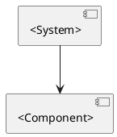

# Building Block View

This chapter describes the static decomposition of the system into building blocks and responsibilities.

## Component Overview

`<Describe the main modules, packages, services, commands, UI areas, or deployable units.>`

## Component Design Items

### `<Component Name>`
`dsn~<component-id>~1`

`<Describe the component responsibility, important collaborators, and why this design covers the linked scenario.>`

Status: draft

Covers:
- `scn~<scenario-id>~1`

Needs: impl

## Open Issues

* `<missing component responsibility, unclear dependency direction, or mismatch between code and requirements>`
