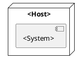

# Deployment View

This chapter describes how the system is packaged and deployed in its execution environment.

## Deployment Environment

`<Describe where and how the system runs.>`

## Runtime Nodes

The relevant deployment nodes are:

* `<host, process, container, service, database, browser, IDE, device, or file system location>`

## Deployment Diagram
<!-- The granularity for the PlantUML diagram below should be coarse. High-level components and artifacts only. Do not go down to class level! Adapt as necessary.-->

## Deployment Strategy

`<Describe installation, startup, configuration, updates, local/remote execution, network use, and operational assumptions.>`

## Open Issues

* `<deployment contradiction, undocumented runtime dependency, or unclear operational boundary>`
