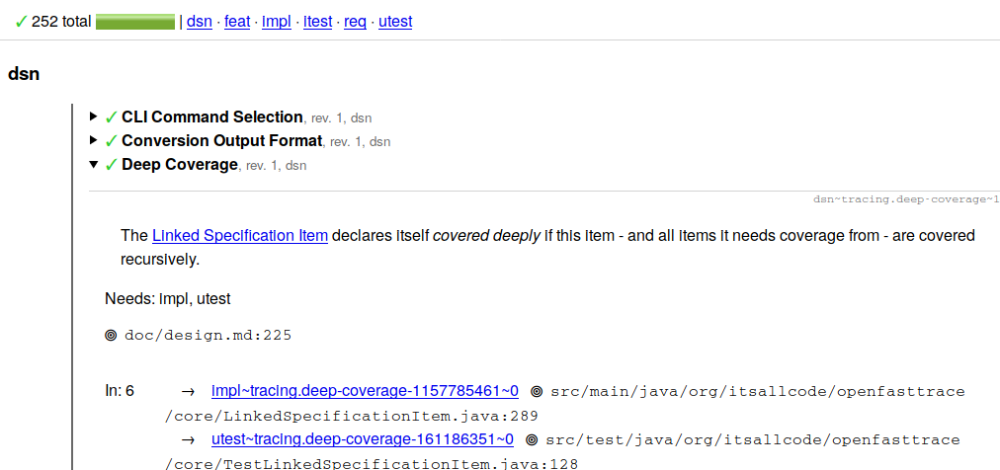

#  OpenFastTrace

## What is OpenFastTrace?

OpenFastTrace (short OFT) is a requirement tracing suite. Requirement tracing helps you keeping track of whether you actually implemented everything you planned to in your specifications. It also identifies obsolete parts of your product and helps you getting rid of them.

You can learn more about requirement tracing and how to use OpenFastTrace in the [user guide](doc/user_guide.md).

Below you see a screenshot of of a HTML tracing report where OFT traces itself. You see a summary followed by a detail view of the traced requirements. 



## Project Information

[](https://github.com/itsallcode/openfasttrace/actions/workflows/build.yml)
[](http://search.maven.org/#search%7Cga%7C1%7Cg%3A%22org.itsallcode.openfasttrace%22%20a%3A%22openfasttrace%22)

Sonarcloud status:

[](https://sonarcloud.io/dashboard?id=org.itsallcode.openfasttrace%3Aopenfasttrace-root)
[](https://sonarcloud.io/dashboard?id=org.itsallcode.openfasttrace%3Aopenfasttrace-root)
[](https://sonarcloud.io/dashboard?id=org.itsallcode.openfasttrace%3Aopenfasttrace-root)
[](https://sonarcloud.io/dashboard?id=org.itsallcode.openfasttrace%3Aopenfasttrace-root)
[](https://sonarcloud.io/dashboard?id=org.itsallcode.openfasttrace%3Aopenfasttrace-root)
[](https://sonarcloud.io/dashboard?id=org.itsallcode.openfasttrace%3Aopenfasttrace-root)
[](https://sonarcloud.io/dashboard?id=org.itsallcode.openfasttrace%3Aopenfasttrace-root)
[](https://sonarcloud.io/dashboard?id=org.itsallcode.openfasttrace%3Aopenfasttrace-root)
[](https://sonarcloud.io/dashboard?id=org.itsallcode.openfasttrace%3Aopenfasttrace-root)
[](https://sonarcloud.io/dashboard?id=org.itsallcode.openfasttrace%3Aopenfasttrace-root)
[](https://sonarcloud.io/dashboard?id=org.itsallcode.openfasttrace%3Aopenfasttrace-root)

**Quick Links**

* [Blog](https://blog.itsallcode.org/)
* [User Guide](doc/user_guide.md)
* [Changelog](doc/CHANGELOG.md)
* [OpenFastTrace stories](https://github.com/itsallcode/openfasttrace/wiki/OFT-Stories)
* [Developer Guide](doc/developer_guide.md)
* [Contributing guide](CONTRIBUTING.md)
* [Command Line Usage](doc/usage.txt)
* [Design](doc/design.md)
* [System Requirements](doc/system_requirements.md)

## Using OpenFastTrace

If you want to use OFT, you have the choice between using it as part of your build process &mdash; typically with Maven or Gradle. Or you can run OFT from the command line.

Check the [user guide](doc/user_guide.md) for detailed information on how to use OpenFastTrack.

## Getting OpenFastTrace

OpenFastTrace at it's core is a Java Archive (short "[JAR](https://docs.oracle.com/javase/8/docs/technotes/guides/jar/jar.html#JAR%20Manifest)"). This file contains the OpenFastTrace Library and an entry point for [running OFT from the command line](#running-openfasttrace).

### Getting Pre-Built Packages

Pre-Built JAR files (called `openfasttrace-3.2.1.jar`) are available from the following places:

* [Maven Central](https://repo1.maven.org/maven2/org/itsallcode/openfasttrace/openfasttrace/3.2.1/openfasttrace-3.2.1.jar)
* [GitHub](https://github.com/itsallcode/openfasttrace/releases/download/3.2.1/openfasttrace-3.2.1.jar)
 
Check our [developer guide](doc/developer_guide.md#getting-the-openfasttrace-library) to learn how to use the OFT JAR as dependency in your own code with popular build tools.

## Installation

### Runtime Dependencies

OpenFastTrace 3.0.0 and above only needs a Java 11 (or later) runtime environment to run. Older versions of OpenFastTrace can run with Java 8.

#### Installation of Runtime Dependencies on Linux

##### Ubuntu or Debian

If you just want to run OFT:

    apt-get install openjdk-11-jre

## Running OpenFastTrace

The most basic variant to run OpenFastTrace is directly from the JAR file via the command line:

```bash
java -jar product/target/openfasttrace-2.3.5.jar trace /path/to/directory/being/traced
```

If you want to run OFT automatically as part of a continuous build, we recommend using our [Gradle Plugin](https://github.com/itsallcode/openfasttrace-gradle).

For more details about how to run OFT please consult the [user guide](doc/user_guide.md).

## Development

If you want to learn how to build OpenFastTrace, please check our [Developer Guide](doc/developer_guide.md).

You would like to contribute to OFT? Please check out our [Contributor Guide](CONTRIBUTING.md) to get started. 
