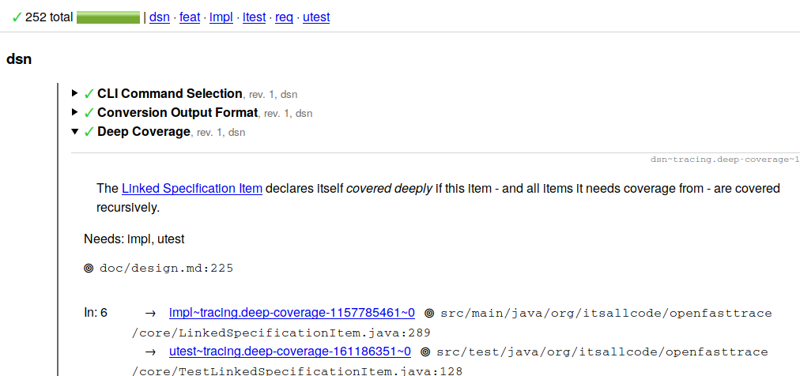

#  OpenFastTrace

## What is OpenFastTrace?

OpenFastTrace (short OFT) is a requirement tracing suite. Requirement tracing keeps track of whether you actually implemented everything you planned to in your specifications. It also identifies obsolete parts of your product and helps you to get rid of them.

You can learn more about requirement tracing and how to use OpenFastTrace in the [user guide](user_guide/user_guide.md).

Below you see a screenshot of an HTML tracing report where OFT traces itself. You see a summary followed by a detail view of the traced requirements. 

## Quick Links

* [📖 User Guide](user_guide/user_guide.md)
* [🦮 Developer Guide](developer_guide/developer_guide.md)
* [📜 Specification](spec/index.md)
* [🔌 Extending OpenFastTrace With Plugins](plugins.md)
* [➕ Changelog](changes/changes.md)
* [ℹ️ About us](about_us.md)

## Project Information

* [💻 GitHub Repository](https://github.com/itsallcode/openfasttrace)
* [📦 Maven Central](https://search.maven.org/search?q=g:org.itsallcode.openfasttrace%20a:openfasttrace)
* [📽️ Introduction Video](https://www.youtube.com/watch?v=tlzMT6RaVWA)
* [🛗 Elevator Pitch](https://github.com/itsallcode/openfasttrace-demo/tree/main?tab=readme-ov-file#elevator-pitch)
* [📢 Blog](https://blog.itsallcode.org/)
* [🗨️ Discussion Board](https://github.com/itsallcode/openfasttrace/discussions)

## Tools and Resources

* [📚 Terminology](terminology.md)
* [🛠 IntelliJ Plugin](https://github.com/itsallcode/openfasttrace-intellij-plugin)
* [🐘 OpenFastTrace@mastodon.social](https://mastodon.social/@OpenFastTrace)
* [🛡️ Security Policy](https://github.com/itsallcode/openfasttrace/blob/main/SECURITY.md)
* [💲 Command Line Usage](https://github.com/itsallcode/openfasttrace/blob/main/core/src/main/resources/usage.txt)
