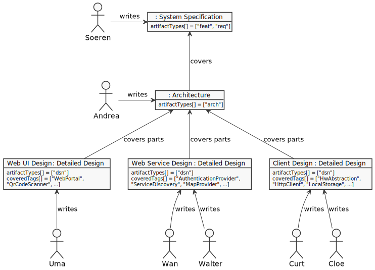

<head><link href="oft_spec.css" rel="stylesheet"></link></head>


# OpenFastTrace (OFT) User Guide

## In a Nutshell

## Introduction

### Who Should Read This Document?

This document is mainly targeted at users wanting to learn how to use OFT for authoring requirement specifications, tracing requirement coverage and converting between requirement formats.

In software projects those users are typically:

* Technical writers
* Requirement engineers
* Software developers
* Quality engineers

For this class of users all sections are of interest.

The document is also helpful for people who just want to get an insight on what OFT is good for and the ideas behind it like:

* Project managers
* IT Support personnel
* People responsible for picking tools (who we recommend should be users too)

Of course requirement engineering and tracing are useful outside the software domains too.

### What is Requirement Tracing?

OpenFastTrace is a requirement tracing suite. Requirement tracing helps you keeping track of whether you actually implemented everything you planned to in your specifications. It also identifies obsolete parts of your product and helps you getting rid of them.

The foundation of all requirement tracing are links between documents, implementation, test, reports and whatever other artifacts your product consists of.

Let's assume you compiled a list of five main features your users asked for. They are very coarse but provide a nice overview of what your project is expected to achieve. Next you decide to write a few dozen user stories to flesh out the details of what your users want.

In order not to forget anything important, you create a link from each user story to the corresponding feature.

After you are done you want to make sure everything is in order. Instead of checking all the links by hand, you let OFT check if every feature is covered in at least one user story.

OFT comes back with a result that one of your features is not covered. You realize that you indeed forgot that one, write two new user stories and link them to the so far uncovered feature. This time OFT comes back with an assuring "OK".

Step-by-step you repeat this pattern for your design document and all resulting artifacts.

### Why do I Need Requirement Tracing?

Requirement tracing is a safety net for non-trivial software projects:

* protects you from forgetting planned parts of your product
* finds orphaned code, documents and resources
* helps you track progress towards milestones
* allows you to prove due diligence during quality audits and customer reviews

### Concepts and Terms

There are some often used terms in the OFT documentation that stand for concepts you should be familiar with when using OFT.

#### Specification Item

"Specification Item" is the general term we use to denominate all normative pieces of specifications and markers to their coverage in the implementation.

Examples:
* Feature definitions
* Requirements in a system requirement specification
* Markers in implementation and tests that signal [coverage](#coverage)

We use this term to better distinguish between the accepted use of the word "requirement" which most people only use for specification items found in requirement documents and the broader use that includes coverage markers.

#### Specification Item ID

The identifier (ID) of a [specification item](#specification-item) is a project-globally unique key which is used to refer to a specification item.

The specification item ID consists of the following parts:
* [Artifact type](#artifact-type)
* name
* [revision](#specification-item-revision)

All parts are integral to the ID. The name alone is neither unique nor complete. In OFT's native document formats the ID is represented as a character string where the three parts are separated by the tilde ("~") symbol.

Examples:

    feat~html-export~1
    req~html5-exporter~1
    dsn~html5-exporter~1
    utest~html5-exporter~4

The name part of the ID must be a character string consisting of ASCII letters and or numbers separated by underscore ("_"), hyphen ("-") or dot ("."). Whitespaces are not allowed.

The revision number is a positive integer number that can be started at zero but out of convention usually is started at one.

#### Artifact Type

The artifact type serves two purposes:

1. identifying the source document type
2. identifying the position in the tracing hierarchy

Artifact types are represented by character strings consisting out of ASCII letters and numbers. No other characters are allowed.

While not enforced by OFT the following strings are well established:

* `feat` - high-level feature
* `req` - user requirement
* `arch` - architectural requirement
* `dsn` - design requirement
* `impl` - implementation
* `utest` - unit test
* `itest` - integration test
* `stest` - system test
* `uman` - user manual

If you don't distinguish between architectural and detailed design we recommend using `dsn` for both. The OFT specification for example does it that way.

How many types you introduce, how you name and stack them is up to you. When we designed OFT, we were clear about the fact that we would not be able to cover all possible artifact types one could imagine, so we did not hardcode them into OFT.

#### Specification Item Revision

The revision of a specification item is intended to obsolete existing coverage links in case the content of a specification item semantically changed. Incrementing the revision voids all existing links to this item so that authors linking to the item know they have to check for changes and adapt the covering items.

Examples:

If you change a requirement that list all browsers that an HTML export needs to be compatible with, you made a semantic changes and should raise the revision number.

If on the other hand you only added a missing period at the end of a sentence, the requirement content did not really change and there is no need to invalidate existing coverage. 

#### Informative Passages

Informative passages of a specification provide explanations and context that is necessary for understanding the subject matter. They do not require coverage though.

#### Normative Passages

Normative passages contain requirements (or in OFT terms ["specification items"](#specification-item). Unlike [informative passages](#informative-passages) they require that someone details, implements or or verifies the contained specification items.

#### Coverage

The term "coverage" describes the relation between [specification items](#specification-item) that require detailing, implementation or verification and the items providing just that. This is done by listing all [artifact types](#artifact-type) where the author of a specification item expects to see coverage for that item.

A specification item is covered when for each of the required artifact types at least one item exists that covers the original item.

#### Deep Coverage

Deep coverage is a special form of coverage. Achieving deep coverage means that not only is a [specification item](#specification-item) covered by all required [artifact types](#artifact-type), but also the covering items are all covered.

#### Terminating Specification Item

A [specification item](#specification-item) terminates a chain of items if it does not require coverage in any [artifact type](#artifact-type).

Example:

    "feat" --needs--> "req" --needs--> "dsn" --needs--> "impl" (terminates chain)
                                                 |----> "utest" (terminates chain)
                                                 '----> "itest" (terminates chain)

## Use Cases

### Writing a Specification

Preconditions:
* Text editor (preferably with syntax highlighting for [Markdown](https://daringfireball.net/projects/markdown/))

OFT's native format for writing specifications is [Markdown](https://daringfireball.net/projects/markdown/)). Markdown is an easy to learn, easy to read markup format that can be written with any text editor and is typically rendered to HTML. For your convenience we recommend using an editor that provides at least syntax highlighting. A preview function is also helpful. In the best case it features an outline view too. Check ["Tools for Authoring OFT Documents"](#tools-for-authoring-oft-documents) for some suggestions.

While OFT introduces additional syntax rules so that it can distinguish between [informative](#informative-passages) and [normative passages](#normative-passages), all elements are valid Markdown.

Let's start with a minimal requirement:

    `req~this-is-the-id~1`
    
    This is the description of the requirement.

Simple as this. This is already a valid and complete OFT requirement. Of course you can enrich the requirement with other information but at the heart of it every requirement is an ID and a description.

It is mostly a matter of taste whether you prefer your specification items to have a title or not. The same requirement above with a title looks like this:

    ### The Requirement Title
    `req~this-is-the-id~1`
    
    This is the description of the requirement.

The upside of giving requirements a title is that they appear in Markdown outline views. The downside is that they introduce redundancy in your specification and therefore have the tendency to become inconsistent with the content of the specification item. If you think in software design terms, the titles violate the ["Don't Repeat Yourself" principle (DRY)](https://en.wikipedia.org/wiki/Don't_repeat_yourself).

The number of hash marks in front of the title must adhere to the rules of Markdown, meaning that if you want to put a [specification item](#specification-item) inside a section with a level two header, the item title must start with three hash marks.

At the moment the specification item is a [terminating item](#terminating-specification-item) because it does not require coverage by any [artifact type](#artifact-type). Since a user level requirement always needs coverage in other artifact types, we are going to add this next.

    ### The Requirement Title
    `req~this-is-the-id~1`
    
    This is the description of the requirement.
    
    Needs: dsn, uman

Now the item must be covered in the design ("dsn") and user manual ("uman"). Remember you can introduce your own artifact types depending on the needs of your project.

Of course you can embed specification items into normal Markdown text. This adds the necessary [informative](#informative-passages) context that is required to understand the [normative passages](#normative-passages).

    # ACME portable hole
       
    ## Introduction
   
    This document describes the user requirements for the ACME portable hole
    ...
    
    ## Functional Requirements
    
    This section lists the functional requirements of the ACME portable hole.
    Non-functional requirements are described in the section
    [quality scenarios](#quality-scenarios).
    
    ### The Requirement Title
    `req~this-is-the-id~1`
    
    This is the description of the requirement.
    
    Needs: dsn, uman

Requirements should be accompanied by a rationale in all cases where the reason for the requirement is not immediately obvious. A comment can be used for explanatory parts, warnings or other information that is neither normative nor fits into the rationale.

    `arch~acme-client-uses-exponential-back-off-strategy~1`
    
    If the ACME client cannot reach the ACME server, it uses a back-off strategy
    with exponentially growing retry interval.
    
    Rationale:
    If the ACME server comes up again after a failure, it would be under heavy
    load immediately if all clients tried to reestablish their connections at
    the same time. ...
    
    Comment:
    Since the implementation depends on the hardware capabilities of the client,
    the details are up to the detailed design.
    
    Needs: dsn 

### Delegating Requirement Coverage

Consider a situation where you are responsible for the high-level software architecture of your project. You define the component breakdown, the interfaces and the interworking of the components. You get your requirements from a system requirement specification, but it turns out many of those incoming requirements are at a detail level that does not require design decisions on inter-component-level but rather affects the internals of a single component.

In those cases it would be a waste of time to repeat the original requirement in your architecture just to hand them down to the detailed design of a component. Instead what you need is a fast way to express "yes, I read that requirement and I am sure it does not need design decisions in the high-level architecture."

To achieve this OFT features a shorthand notation for delegating the job of covering a specification item to one or more different artifact types.

In the following example a requirement in the system requirement specification (artifact type `req`) stated that the web user interface of your product should use the corporate design. This clearly does not require an architectural decision (`arch`), so you forward it directly to the detailed design (`dsn`) level.  

    arch --> dsn : req~web-ui-uses-corporate-design~1

### Distributing the Detailing Work

In projects of a certain size you always reach the point where a single team is not enough to process the workload. As a consequence is the teams must find a way to distribute the work. A popular approach is splitting the architecture into components that are as independent as possible. Each team is then responsible for one or more distinct components. While the act of assigning the work should never be done inside of the specification, at least the specification can prepare criteria on which to split the work.

One proven way to do this is to use tags. The teams then decide for which specification items with which tags they are responsible.



In our example it is the job of Andrea the architect to create a system architecture for the system specification coming from Soeren. Andrea defines a set of components which communicate with each other through well-defined, minimal interfaces. Each component is designed so that it can independently developed and tested. Only an integration test is later necessary to prove that the components work together as designed. You tag each architectural requirement with the names of the affected components.

A typical requirement would then look like this (shortened to emphasize the "needs" and "tags" part): 

    `arch~authentication-provider-requires-valid-client-certificate~1`
    
    The authentication provider accepts only connections from clients offering a client certificate ...
    
    Needs: dsn
    
    Tags: AuthenticationProvider

The development teams distribute the components among themselves and use the tags to filter for only the [specification items](#specification-item) they are responsible for. The teams then cover all items they are responsible for in the detailed design and deliver everything to an integrator. The sum of all detailed designs must then cover the architectural design.

Wan and Wu from the web service team in our example would run an OFT convert job like this to pick the parts of the architecture that they affected by:

    oft convert -t AuthenticationProvider,ServiceDiscovery,MapProvider import/arch/ > arch_filtered_by_web_services.xml

This tells OFT to read all known specification files from the directory "import/arch" and filter by a list of tags. The result is a list of requirements that match the tag filter.

If you want to also import specification items that do not have any tags, add a single underscore "_" as the first entry in the comma-separated list of tags:

    oft convert -t _,AuthenticationProvider,ServiceDiscovery,MapProvider import/arch/ > arch_filtered_by_web_services.xml
     

### Tracing the Whole Chain

If you plan to assess the coverage state of your product as a whole, you need to trace the full chain including all artifact.

### Tracing the Whole Chain in the Same File System

Preconditions:

* All artifacts are readable for the user executing OFT

Description:

In a small project you probably have all artifacts in the same file system - most likely under a common root directory.
In this case the easiest way to get a full trace is to list all the directories that OFT should search for artifacts to import.

Let's assume a typical Java project with the following directory layout:

    /home/git/my-project
      |-- doc                      manuals, requirement specification and design
      |-- src
      |    |-- main
      |    |     '-- java          implementation
      |    '-- test
     ...         '-- java          unit and integration tests
     

In this case the minimal OFT command line looks like this:

```sh
PROJECT_ROOT='/home/git/my-project/'
oft trace "$PROJECT_ROOT"/doc "$PROJECT_ROOT"/src/main/java "$PROJECT_ROOT"/src/test/java
```

Or if you prefer it shorter:

```sh
cd /home/git/my-project/
oft trace doc src/main/java src/test/java
```

The first variant is better suited for integration into scripts where you usually want to avoid changing the directory.

By default this will produce a plain text trace that displays a details of all defect specification items and a summary.

See also:
* [Tracing Options](#tracing-options) for controlling the tracing output

### HTML Tracing Reports

While plain text reports are perfect for debugging you tracing chain, sometimes you need reports that are more optically appealing. This is usually true if you have to show reports to management or to quality assessors who usually focus on summaries and statistics rather than detail results. In this case you can tell OFT to create reports in HTML format by adding the `-o html` switch.

```sh
oft trace -o html
```

## Reference

### OFT Command Line

The OFT command line looks like this:

    oft command [option ...] [<input file or directory> ...]

Where `command` is one of

* `trace` - create a requirement trace document
* `convert` - convert to a different requirements format

and `option` is one or more of the options listed below.

#### Import options

    -a, --wanted-artifact-types <artifact type>[,...]

Import only specification items where the artifact type matches one of the listed types.

    -t, --wanted-tags [_,]<tag>[,...]

Import only specification items that have at least one of the listed tags. If you add a single underscore "_" as first entry in the list, specification items that no tags at all are also imported.

#### Tracing options

    -o, --output-format <format>

The format of the report.

One of:
* `plain`
* `html` 

Defaults to `plain`.

    --v, --verbosity-level <level>

The verbosity of the tracing report.

* `quiet` - no output (in case only the return code is used)
* `minimal` - display `ok` or `not ok`
* `summary` - display only the summary, not individual specification items
* `failures` - list of defect specification items
* `failure_summaries` - list of summaries for defect specification items
* `failure_details` - summaries and details for defect specification items
* `all` -  summaries and details for all specification items

Defaults to `failure_details`.

#### Converting Options

    -o, --output-format <format>

Format into which requirements are converted.

One of
* `specobject`

Defaults to `specobject`.

#### Common Options

    -f, --file <path>

The output file or in case the output consists of more than one file, the output path. Defaults to STDOUT if not given.

    -i, --ignore-artifact-types <type<[,<type> ...]

Choose one or more artifact types which are going to be ignored during import. Affects specification items of that type, needed coverage and links to specification items of that type.

    -n, --newline <format>

Newline format, one of
* `unix`
* `windows`
* `oldmac`

Defaults to the platform standard if not given.

## OFT API

If you are a software developer planning to integrate OFT into one of your programs or scripts, you will probably want to use the OFT API.

Below you find a few short examples of how to use the OFT API. For details check the JavaDoc documentation of the interfaces in the source code.

* [org.itsallcode.openfasttrace.Converter](../src/main/java/org/itsallcoded/openfasttrace/Converter.java)
* [org.itsallcode.openfasttrace.Reporter](../src/main/java/org/itsallcoded/openfasttrace/Reporter.java)

### Using OFT From Java

The Java interface uses the "fluent programming" paradigm to make the code more compact and easy to read.

#### Using the Converter From Java

The following example code configures a `Converter` to read input form the relative paths `doc`, `src/main/java` and `src/main/test` and output the result to `/tmp/out.xml` in SpecObject format using Unix newlines. 

```JAVA
import org.itsallcode.openfasttrace.Converter;
import org.itsallcode.openfasttrace.core.Newline;
import org.itsallcode.openfasttrace.mode.ConvertMode;

final List<String> inputs = Arrays.asList("doc", "src/main/java", "src/main/test");
final Converter converter = new ConvertMode();

converter.addInputs(inputs)
         .setNewline(Newline.UNIX)
         .convertToFileInFormat("/tmp/out.xml", "specobject");
```

#### Using the Tracer From Java

The example below shows how to read documents for the `doc` directory ignoring the artifact types `feat` and `dsn`. The collected specification items are then traced and finally output in a plain text report to STDOUT with verbosity level `ALL`. 

```JAVA
import org.itsallcode.openfasttrace.Reporter;
import org.itsallcode.openfasttrace.core.Trace;
import org.itsallcode.openfasttrace.mode.ReportMode;

final List<String> inputs = Arrays.asList("doc");
final List<String> ignoreTypes = Arras.asList("feat", "dsn"); 
final Reporter reporter = new ReportMode();

reporter.addInputs(inputs)
        .ignoreArtifactTypes(ignoreTypes);

final Trace trace = reporter.trace();

reporter.setReportVerbosity(ReportVerbosity.ALL)
        .reportToStdOutInFormat(trace, "plain");

if(trace.isAllCovered())
{
    // do something
}
```

## Tool Support

### Tools for Authoring OFT Documents

The following editors and integrated development environments are well suited for authoring OFT documents. The list is not exhaustive, any editor with Markdown capabilities can be used.

Editor / IDE                                             | Syntax highl. | Preview | Outline | HTML export
---------------------------------------------------------|---------------|---------|---------|------------
[Gedit](https://wiki.gnome.org/Apps/Gedit)               | y             |         |         |
[Eclipse](https://eclipse.org) with WikiText plug-in     | y             | y       | y       | y
[Eclipse](https://eclipse.org) with GMF plug-in          |               | y       |         |
[Vim](https://www.vim.org/)                              | y             |         |         |
[Visual Studio Code](https://code.visualstudio.com/)     | y             | y       | y       |
