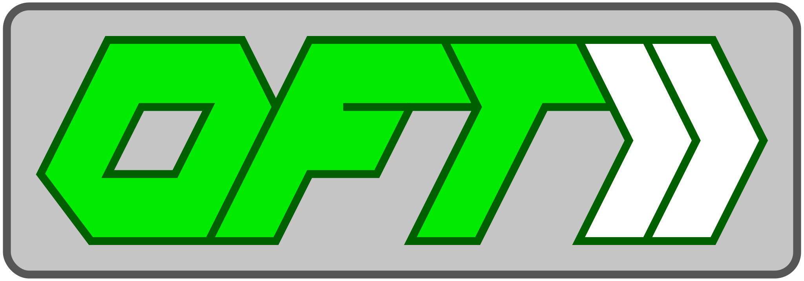

<head><link href="oft_spec.css" rel="stylesheet"></link></head>



# OpenFastTrace User Guide

## In a Nutshell


## What is Requirement Tracing?

OpenFastTrace is a requirement tracing suite. Requirement tracing helps you keeping track of whether you actually implemented everything you planned to in your specifications. It also identifies obsolete parts of your product and helps you getting rid of them.

The foundation of all requirement tracing are links between documents, implementation, test, reports and whatever other artifacts your product consists of.

Let's assume you compiled a list of five main features your users asked for. They are very coarse but provide a nice overview of what your project is expected to achieve. Next you decide to write a few dozen user stories to flesh out the details of what your users want.

In order not to forget anything important, you create a link from each user story to the corresponding feature.

After you are done you want to make sure everything is in order. Instead of checking all the links by hand, you let OFT check if every feature is covered in at least one user story.

OFT comes back with a result that one of your features is not covered. You realize that you indeed forgot that one, write two new user stories and link them to the sofar uncovered feature. This time OFT comes back with an assuring "OK".

Step-by-step you repeat this pattern for your design document and all resulting artifacts.

## Why do I Need Requirement Tracing?

Requirement tracing is a safety net for non-trivial software projects:

* protects you from forgetting planned parts of your product
* finds orphaned code, documents and resources
* helps you track progress towards milestones
* allows you to prove due diligence during quality audits and customer reviews

## Reference

### OFT Command Line

The OFT command line looks like this:

    oft command [option ...] [<input file or directory> ...]

Where `command` is one of

* `trace` - create a requirement trace document
* `convert` - convert to a different requirements format

and `option` is one or more of the options listed below.

#### Tracing options

    -o, --output-format <format>

The format of the report.

One of:
* `plain`

Defaults to `plain`.

    --v, --verbosity-level <level>

The verbosity of the tracing report.

* `quiet` - no output (in case only the return code is used)
* `minimal` - display `ok` or `not ok`
* `summary` - display only the summary, not individual specification items
* `failures` - list of defect specification items
* `failure_summaries` - list of summaries for defect specification items
* `failure_details` - summaries and details for defect specification items
* `all` -  summaries and details for all specification items

Defaults to `failure_details`.

#### Converting Options

    -o, --output-format <format>

Format into which requirements are converted.

One of
* `specobject`

Defaults to `specobject`.

#### Common Options

    -f, --file <path>

The output file or in case the output consists of more than one file, the output path. Defaults to STDOUT if not given.

    -i, --ignore-artifact-types <type<[,<type> ...]

Choose one or more artifact types which are going to be ignored during import. Affects specification items of that type, needed coverage and links to specification items of that type.

    -n, --newline <format>

Newline format, one of
* `unix`
* `windows`
* `oldmac`

Defaults to the platform standard if not given.

## OFT API

If you are a software developer planning to integrate OFT into one of your programs or scripts, you will probably want to use the OFT API.

Below you find a few short examples of how to use the OFT API. For details check the JavaDoc documentation of the interfaces in the source code.

* [org.itsallcode.openfasttrace.Converter](../src/main/java/org/itsallcoded/openfasttrace/Converter.java)
* [org.itsallcode.openfasttrace.Reporter](../src/main/java/org/itsallcoded/openfasttrace/Reporter.java)

### Using OFT From Java

The Java interface uses the "fluent programming" paradigm to make the code more compact and easy to read.

#### Using the Converter From Java

The following example code configures a `Converter` to read input form the relative paths `doc`, `src/main/java` and `src/main/test` and output the result to `/tmp/out.xml` in SpecObject format using Unix newlines. 

```JAVA
import org.itsallcode.openfasttrace.Converter;
import org.itsallcode.openfasttrace.core.Newline;
import org.itsallcode.openfasttrace.mode.ConvertMode;

final List<String> inputs = Arrays.asList("doc");
final Converter converter = new ConvertMode();

converter.addInputs(inputs)
         .setNewline(Newline.UNIX)
         .convertToFileInFormat("/tmp/out.xml", "specobject");
```

#### Using the Tracer From Java

The example below shows how to read documents for the `doc` directory ignoring the artifact types `feat` and `dsn`. The collected specification items are then traced and finally output in a plain text report to STDOUT with verbosity level `ALL`. 

```JAVA
import org.itsallcode.openfasttrace.Reporter;
import org.itsallcode.openfasttrace.core.Trace;
import org.itsallcode.openfasttrace.mode.ReportMode;

final List<String> inputs = Arrays.asList("doc");
final List<String> ignoreTypes = Arras.asList("feat", "dsn"); 
final Reporter reporter = new ReportMode();

reporter.addInputs(inputs)
        .ignoreArtifactTypes(ignoreTypes);

final Trace trace = reporter.trace();

reporter.setReportVerbosity(ReportVerbosity.ALL)
        .reportToStdOutInFormat(trace, "plain");

if(trace.isAllCovered())
{
    // do something
}
```