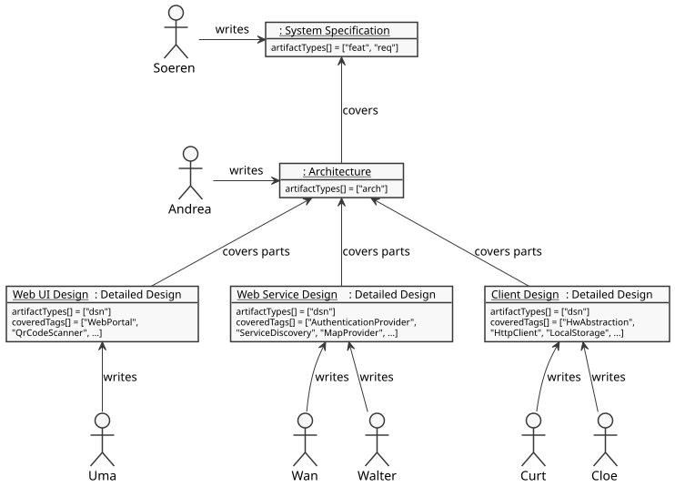

### Distributing the Detailing Work

In projects of a certain size you always reach the point where a single team is not enough to process the workload. As a consequence, the teams must find a way to distribute the work. A popular approach is splitting the architecture into components that are as independent as possible. Each team is then responsible for one or more distinct components. While the act of assigning the work should never be done inside the specification, at least the specification can prepare criteria on which to split the work.

One proven way to do this is to use tags. The teams then decide for which specification items with which tags they are responsible.

In our example it is the job of Andrea the architect to create a system architecture for the system specification coming from Soeren. Andrea defines a set of components which communicate with each other through well-defined, minimal interfaces. Each component is designed so that it can be independently developed and tested. Only an integration test is later necessary to prove that the components work together as designed. You tag each architectural requirement with the names of the affected components.

A typical requirement would then look like this (shortened to emphasize the "needs" and "tags" part): 

    `arch~authentication-provider-requires-valid-client-certificate~1`
    
    The authentication provider accepts only connections from clients offering a client certificate ...
    
    Needs: dsn
    
    Tags: AuthenticationProvider

The development teams distribute the components among themselves and use the tags to filter for only the [specification items](../../terminology.md#specification-item) they are responsible for. The teams then cover all of these in the detailed design and deliver everything to an integrator. The sum of all detailed designs must then cover the architectural design.

Wan and Wu from the web service team in our example run an OFT convert job like this to pick the parts of the architecture they are affected by:

    oft convert -t AuthenticationProvider,ServiceDiscovery,MapProvider import/arch/ > arch_filtered_by_web_services.xml

This tells OFT to read all known specification files from the directory "import/arch" and filter by a list of tags. The result is a list of requirements that match the tag filter.

If you want to also import specification items that do not have any tags, add a single underscore "_" as the first entry in the comma-separated list of tags:

    oft convert -t _,AuthenticationProvider,ServiceDiscovery,MapProvider import/arch/ > arch_filtered_by_web_services.xml
